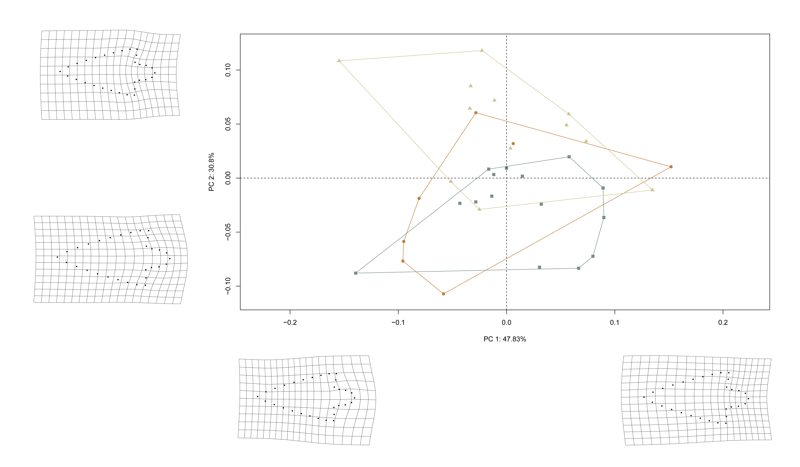

# Geometric morphometrics

## Load packages + data
```{r load, echo=TRUE, warning=FALSE}
# download most recent software version
#devtools::install_github("geomorphR/geomorph", ref = "Stable", build_vignettes = TRUE)
#devtools::install_github("mlcollyer/RRPP")

# load analysis packages
library(here)
library(StereoMorph)
library(geomorph)
library(ggplot2)
library(dplyr)
library(wesanderson)

# read shape data and define number of sLMs
shapes <- readShapes("shapes")
shapesGM <- readland.shapes(shapes, nCurvePts = c(10,3,5,5,3,10))

# read qualitative data
qdata <- read.csv("qdata.csv",
                  header = TRUE,
                  row.names = 1)
```

## Generalised Procrustes Analysis

```{r gpa, echo=TRUE, out.width = "100%", dpi = 300, warning=FALSE}
# gpa
Y.gpa <- gpagen(shapesGM, print.progress = FALSE)
plot(Y.gpa)
```

## Boxplot (centroid size)

```{r box, echo=TRUE, out.width = "100%", dpi = 300, warning=FALSE}
# dataframe
gdf <- geomorph.data.frame(shape = Y.gpa$coords,
                           size = Y.gpa$Csize,
                           raw.mat = qdata$raw.mat)

# add centroid size to qdata
qdata$csz <- Y.gpa$Csize

# attributes
csz <- qdata$csz
raw.mat <- qdata$raw.mat

# palette
pal = wes_palette("Moonrise2")

# boxplot of Perdiz arrow points by raw.mat
csz.temp <- ggplot(qdata, aes(x = raw.mat, y = csz, color = raw.mat)) +
  geom_boxplot() +
  geom_dotplot(binaxis = 'y', stackdir = 'center', dotsize = 0.3) +
  scale_color_manual(values = pal) +
  theme(legend.position = "none") +
  theme(axis.text.x = element_text(angle = 90, vjust = 0.5, hjust=1)) +
  labs(x = 'Raw Material', y = 'Centroid Size')

# render plot
csz.temp
```

## Principal Components Analysis

```{r pca, echo=TRUE, out.width = "100%", dpi = 300, warning=FALSE}
# pca
pca <- gm.prcomp(Y.gpa$coords)
summary(pca)

# set plot parameters
pch.gps <- c(15:17)[as.factor(raw.mat)]
col.gps <- pal[as.factor(raw.mat)]
col.hull <- c("#C27D38","#798E87","#CCC591")

# pca plot
pc.plot <- plot(pca,
                asp = 1,
                pch = pch.gps,
                col = col.gps)
shapeHulls(pc.plot,
           groups = raw.mat,
           group.cols = col.hull)
```

### Minima/maxima of PC1/2

```{r min.max, echo=TRUE, out.width = "100%", dpi = 300, warning=FALSE}
# plot x/y maxima/minima
# x - minima
mean.shape <- mshape(Y.gpa$coords)
plotRefToTarget(pca$shapes$shapes.comp1$min, 
                mean.shape)

# x - maxima
plotRefToTarget(pca$shapes$shapes.comp1$max, 
                mean.shape)

# y - minima
plotRefToTarget(pca$shapes$shapes.comp2$min, 
                mean.shape)

# y - maxima
plotRefToTarget(pca$shapes$shapes.comp2$max, 
                mean.shape)
```

### Composite

```{r composite.pca, out.width = "100%", dpi = 300, echo=TRUE}

```

## Procrustes ANOVA: Shape and size

```{r ss, echo=TRUE, out.width = "100%", dpi = 300, warning=FALSE}
# shape
fit.sh.reg <- procD.lm(shape ~ raw.mat,
                       data = gdf,
                       print.progress = FALSE,
                       iter = 9999)

# shape
anova(fit.sh.reg)

# size
fit.sz.reg <- procD.lm(size ~ raw.mat,
                       data = gdf,
                       print.progress = FALSE,
                       iter = 9999)

# size
anova(fit.sz.reg)
```

## Allometry

```{r allom, echo=TRUE, out.width = "100%", dpi = 300, warning=FALSE}
# allometry
fit.size <- procD.lm(shape ~ size,
                     data = gdf,
                     print.progress = FALSE,
                     iter = 9999)

# allometry
anova(fit.size)

## PLS
allom.PLS <- two.b.pls(gdf$size,
                       gdf$shape,
                       print.progress = FALSE)
allom.PLS
plot(allom.PLS)
```

### Allometry models

```{r u.allom, echo=TRUE, out.width = "100%", dpi = 300, warning=FALSE}
# allometry - unique allometries -> raw.mat
unique.allom <- procD.lm(shape ~ size * raw.mat, 
                         data = gdf, 
                         print.progress = FALSE, 
                         iter = 9999)

# common allometry, different means -> raw.mat
common.allom <- procD.lm(shape ~ size + raw.mat, 
                         data = gdf, 
                         print.progress = FALSE, 
                         iter = 9999)

# anova
anova(unique.allom, 
      common.allom, 
      print.progress = FALSE)

# result not significant; common allometry most appropriate

# predline
plotAllometry(common.allom, 
              size = gdf$size, 
              logsz = TRUE, 
              method = "PredLine",
              col = col.gps,
              pch = pch.gps)

# regscore
plotAllometry(common.allom, 
              size = gdf$size, 
              logsz = TRUE, 
              method = "RegScore",
              col = col.gps,
              pch = pch.gps)
```

## Morphological integration

```{r integ, echo=TRUE, out.width = "100%", dpi = 300, warning=FALSE}
land.gps <- c("A","A","B","B","B","A","A","A","A","A","A","A","A","A",
              "B","B","B","B","B","B","B","B","A","A","A","A","A","A",
              "A","A")
it <- integration.test(Y.gpa$coords,
                       partition.gp = land.gps,
                       iter = 9999,
                       print.progress = FALSE)

summary(it)
plot(it)
```

## Morphological disparity

```{r morph.disp, echo=TRUE, out.width = "100%", dpi = 300, warning=FALSE}
morphol.disparity(shape ~ raw.mat,
                  groups = qdata$raw.mat,
                  data = gdf,
                  print.progress = FALSE,
                  iter = 9999)
```

## Shape vs linear data

```{r linear.shape, echo=TRUE, out.width = "100%", dpi = 300, warning=FALSE}
# are shape and linear data correlated?
# subset linear data
linear <- qdata %>%
  select(maxl, maxw, maxth, maxstl, maxstw)

# 2B-PLS
shape.meas.cor <- two.b.pls(A1=Y.gpa$coords, 
                            A2=linear,
                            print.progress = FALSE,
                            iter = 9999)
summary(shape.meas.cor)
plot(shape.meas.cor)
```

## Mean shapes

```{r mshape, echo=TRUE, out.width = "100%", dpi = 300, warning=FALSE}
# subset landmark coordinates to produce mean shapes
new.coords <- coords.subset(A = Y.gpa$coords,
                            group = qdata$raw.mat)
names(new.coords)

# group shape means
mean <- lapply(new.coords, mshape)

# plot mean shapes
plot(mean$chert)
plot(mean$quartzite)
plot(mean$s.wd)

# comparison plots
plotRefToTarget(mean$chert,
                mean$quartzite,
                method = "points",
                mag = 1)

plotRefToTarget(mean$chert,
                mean$s.wd,
                method = "points",
                mag = 1)

plotRefToTarget(mean$quartzite,
                mean$s.wd,
                method = "points",
                mag = 1)
```
